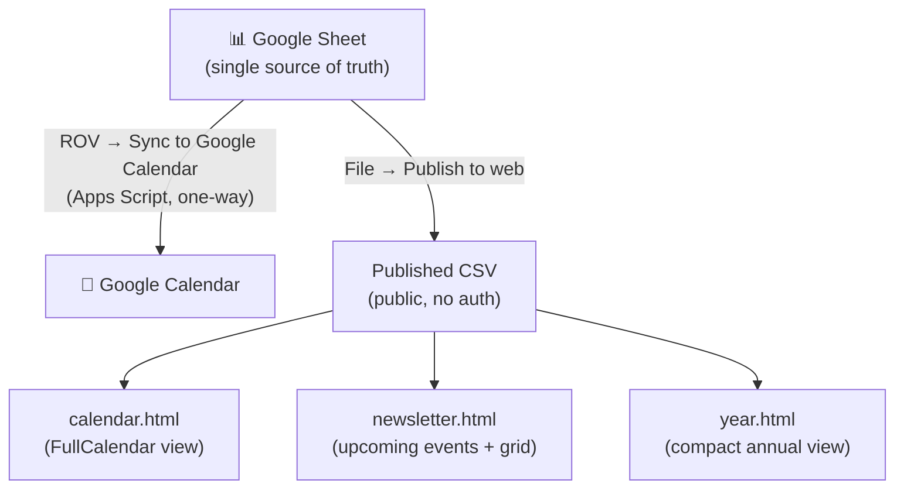

# SLV ROV Club Website

Website for the **San Lorenzo Valley ROV Club**, taught by Eric Brown at San Lorenzo Valley schools. Hosted on GitHub Pages at [rov.porttack.com](https://rov.porttack.com).

| Resource | Link |
|---|---|
| Live site | [rov.porttack.com](https://rov.porttack.com) |
| Event spreadsheet | [Google Sheet](https://docs.google.com/spreadsheets/d/1SLUNLWSTkfGSynF8cHlQ_-DTQtXsS1t6KsRQ4U6am7k/edit?usp=sharing) (read-only) |
| Google Calendar | [ROV Club Calendar](https://calendar.google.com/calendar/u/0/embed?src=c_148f1519506e3d16ae70587c9b7790fc5aa331e2cfd689a0e73fe707a72e0ecb@group.calendar.google.com&ctz=America/Los_Angeles) |

Everything here is **driven by a single Google Sheet** that Eric manages. The website reads from that sheet automatically — no one needs to touch the website itself after initial setup.

The site provides three views of the same event data:

- **Calendar** — FullCalendar month/list view of all events
- **Newsletter** — Upcoming events with full detail cards, a skim list, and a 3-month grid
- **Year** — Compact two-column annual view (July–June school year), color-coded by event type

---

## How the pieces fit together



The Google Calendar is kept in sync manually by running **ROV → Sync to Google Calendar** from the sheet menu whenever events are added or changed. `noschool` events are website-only and are never pushed to the calendar.

---

## Repository layout

| Path | Purpose |
|---|---|
| `index.md` | Homepage with links to the three views |
| `calendar.html` | FullCalendar 6 interactive calendar, reads Sheet CSV |
| `newsletter.html` | Upcoming events detail + skim list + monthly grid |
| `year.html` | Compact July–June annual calendar, color-coded cells |
| `assets/js/rov-common.js` | Shared JS: CSV parser, column map, date/time helpers |
| `appscript/RovSync.gs` | All Apps Script logic (paste into Google Sheet) |
| `_includes/footer.html` | Site footer |
| `_config.yml` | Jekyll config (title, theme, nav pages) |
| `Gemfile` | GitHub Pages gem pin |

---

## Initial setup

### 1. Google Sheet

1. Create (or use an existing) Google Sheet with a tab named **Calendar** (or update `SHEET_NAME` in the script).
2. Open **Extensions → Apps Script** and paste the entire contents of `appscript/RovSync.gs`.
3. Save the script, then navigate to the sheet and reload — the **ROV** menu will appear.
4. Run **ROV → Set Up Sheet**. This writes the column headers, applies formatting, adds the Event Type dropdown, and sets the Cancelled column as a checkbox — covering 500 rows so new entries are ready to go.
5. Update `CALENDAR_ID` at the top of the script to your Google Calendar's ID (find it under Calendar Settings → Integrate calendar). Leave it as `'primary'` to use your main calendar.

### 2. Publish the sheet for the website

1. In the sheet: **File → Share → Publish to web**.
2. Set **Entire document** / **Comma-separated values (.csv)** → click **Publish**.
3. Copy the URL (starts with `https://docs.google.com/spreadsheets/d/e/2PACX-…`).
4. Open `assets/js/rov-common.js` in this repo and paste the URL as the value of `CSV_URL`.
5. Commit and push — GitHub Pages rebuilds in about a minute.

The sheet re-publishes automatically as you edit, so the website always reflects current data.

### 3. Install the edit trigger (run once)

Run **ROV → Install Edit Trigger**. This lets row colors update automatically whenever you change the Event Type or Cancelled columns.

### 4. Sync to Google Calendar

Enter events in the sheet, then run **ROV → Sync to Google Calendar** to push them. Each synced event gets an ID written to column K so subsequent syncs update rather than duplicate. Run it again after any edits.

---

## Apps Script menu reference

| Menu item | What it does |
|---|---|
| Set Up Sheet | Writes headers, applies formatting, adds dropdowns and checkboxes for 500 rows |
| Format All Rows | Re-applies row colors based on current Event Type / Cancelled values |
| Sync to Google Calendar | Pushes all non-cancelled, non-noschool events to the calendar; updates existing events; deletes cancelled ones |
| Remove Synced Events | Deletes all ROV events from the calendar and clears column K |
| Website Setup Guide | Step-by-step dialog for publishing the sheet CSV and connecting it to the site |
| Calendar Sync Help | Instructions for finding your Calendar ID and authorizing the sync |
| Install Edit Trigger | Installs the onEdit trigger for automatic row coloring (run once) |

---

## Column schema (Google Sheet, columns A–K)

| Col | Header | Notes |
|---|---|---|
| A | Event Type | Dropdown — see event types below |
| B | Cancelled | Checkbox — grays out the row; removes the event from the calendar on next sync |
| C | Date | Date cell — exported as M/D/YY or M/D/YYYY |
| D | Start Time | Time cell — leave blank for all-day events |
| E | End Time | Time cell — defaults to Start + 1 hour in the calendar sync if blank |
| F | Description | Short label shown on the website; defaults to Event Type if blank |
| G | Summary | Longer narrative text shown in the Newsletter detail cards |
| H | Picture URL | Direct `https://` image URL — shown in Newsletter Coming Up cards |
| I | Comments | Internal notes — shown on website but not synced to calendar |
| J | Location | Optional — used as the Google Calendar event location |
| K | Calendar Event ID | Auto-managed by script — **do not edit** |

---

## Event types and colors

| Event Type | Sheet color | Calendar color | Notes |
|---|---|---|---|
| `class` | lavender blue | blue | Regular class session |
| `class-extended` | sky blue | sky blue | Extended class / build session |
| `service` | light orange | orange | Community service events |
| `competition` | light green | green | Competitions and tournaments |
| `workday` | light yellow | amber | Shop workdays |
| `fieldtrip` | light purple | purple | Field trips |
| `mentors` | light pink | pink | Mentor visits or sessions |
| `presentation` | light teal | teal | Presentations / demos |
| `noschool` | light gray | — | No-school days (website only, not synced to calendar) |
| `other` | light red | red | Anything else |

When multiple events fall on the same day in the **Year** view, the highest-priority type wins: competition → field trip → service → mentors → presentation → workday → class-extended → class → other → no school.

---

## Pages

### calendar.html

Interactive month and list calendar powered by [FullCalendar 6](https://fullcalendar.io/). Events are fetched from the published CSV at page load. Event tiles show the abbreviated time range (`3p-5p`) on the first line and the description below. Clicking an event shows a popup with the summary and notes.

### newsletter.html

Dynamically generated from the CSV:

- **Coming Up** — Full detail cards for the next 5 non-cancelled events (date, time, location, description, picture, summary, notes)
- **Looking Ahead** — Skim list of all future events grouped by month, with map links where a location is set
- **Calendar Grid** — 3-month compact grid with color-coded days

### year.html

Compact two-column annual calendar for the current July–June school year. Left column: months 1–6; right column: months 7–12. Day cells are colorized by event type; days with no events are plain. The school year resets automatically each July.

---

## Local development

```bash
bundle install
bundle exec jekyll serve
# → http://localhost:4000
```

Requires Ruby and Bundler. The site uses the `github-pages` gem to match the production build exactly.

The calendar, newsletter, and year pages fetch live data from the published Google Sheet CSV at page load, so they work locally as long as the sheet is published.

---

## Tech stack

| Layer | Choice |
|---|---|
| Static site | Jekyll via `github-pages ~> 232` gem |
| Theme | Minima 2.5.1 (classic skin) |
| Hosting | GitHub Pages at [rov.porttack.com](https://rov.porttack.com) |
| Dynamic data | Google Sheets published CSV (no auth required) |
| Calendar widget | FullCalendar 6.x (jsDelivr CDN) |
| Sheet automation | Google Apps Script (paste from `appscript/RovSync.gs`) |
| Shared JS utilities | `assets/js/rov-common.js` — CSV parser, column map, date/time helpers |

No npm, no build pipeline, no bundlers — the site deploys cleanly via GitHub Pages on every push to `main`.
